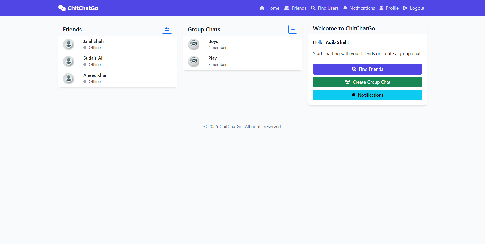

## Real-time Chat Application


ChitChatGo is a feature-rich real-time chat application built with Django and Django Channels. It provides a seamless communication experience with both one-on-one messaging and group chats, complete with user authentication, friend management, and real-time notifications.

## ✨ Features

- **User Authentication**
  - Secure Login and Register
  - Profile customization with profile pictures and bio
  - Online/offline status tracking

- **Friend Management**
  - Send and receive friend requests
  - Accept or reject incoming requests
  - Remove friends
  - Search for users by username, email, or name

- **Real-time Messaging**
  - One-on-one private conversations
  - Group chats with multiple participants
  - Real-time message delivery using WebSockets
  - Typing indicators
  - Read receipts
  - File and image sharing

- **Group Management**
  - Create new groups
  - Add/remove members
  - Update group information and picture
  - Leave or delete groups

- **Real-time Notifications**
  - Message notifications
  - Friend request alerts
  - Group invitation notifications
  - Mark notifications as read

## 🛠️ Technologies Used

- **Backend**
  - Django 4.2+
  - Django Channels 4.0+ (for WebSockets)
  - PostgreSQL (production)
  - ASGI server (Daphne)

- **Frontend**
  - HTML5, CSS3, JavaScript
  - Bootstrap 5
  - Font Awesome icons

- **Real-time Communication**
  - WebSockets
  - ASGI (Asynchronous Server Gateway Interface)

## 📋 Prerequisites

- Python 3.8+
- pip (Python package manager)
- Git

## 🚀 Installation

1. **Clone the repository**

```shell
git clone https://github.com/aqibcs/ChitChatGo.git
cd ChitChatGo
```

2. **Create and activate a virtual environment**

```bash
# Create virtual environment
python -m venv env

# Activate virtual environment
# On Windows:
env\Scripts\activate
# On macOS/Linux:
source env/bin/activate
```

3. **Install dependencies**

```bash
pip install -r requirements.txt
```

4. **Apply database migrations**

```bash
python manage.py migrate
```

5. **Create a superuser (admin)**

```bash
python manage.py createsuperuser
```

6. **Create necessary directories**

```shell
mkdir -p media/profile_pics
mkdir -p media/group_pics
mkdir -p media/message_attachments
```

## 🏃‍♂️ Running the Application

### Development Server

```bash
python manage.py runserver
```

### Production Server (with Daphne)

```bash
daphne -b 0.0.0.0 -p 8000 chitchatgo.asgi:application
```

Visit `http://localhost:8000` in your web browser to access the application.


## 🔧 Configuration

### Environment Variables

For production, consider setting the following environment variables:

- `SECRET_KEY`: Django secret key
- `DEBUG`: Set to False in production
- `ALLOWED_HOSTS`: Comma-separated list of allowed hosts

### Database Configuration

By default, the project uses SQLite. For production, consider using PostgreSQL:

```python
# In settings.py
DATABASES = {
    'default': {
        'ENGINE': 'django.db.backends.postgresql',
        'NAME': 'chitchatgo',
        'USER': 'your_username',
        'PASSWORD': 'your_password',
        'HOST': 'localhost',
        'PORT': '5432',
    }
}
```

## 🔒 Security Considerations

- Always use HTTPS in production
- Keep `DEBUG = False` in production
- Regularly update dependencies
- Implement rate limiting for authentication attempts
- Consider using environment variables for sensitive information

## 🤝 Contributing

1. Fork the repository
2. Create your feature branch (`git checkout -b feature/amazing-feature`)
3. Commit your changes (`git commit -m 'Add some amazing feature'`)
4. Push to the branch (`git push origin feature/amazing-feature`)
5. Open a Pull Request

## 📚 Additional Resources

- [Django Documentation](https://docs.djangoproject.com/)
- [Django Channels Documentation](https://channels.readthedocs.io/)
- [Bootstrap Documentation](https://getbootstrap.com/docs/)

## 🔮 Future Enhancements

- Voice and video calling
- Message reactions and replies
- User status messages
- Message search functionality

---

## 👨‍💻 Developed by [Aqib Shah](https://github.com/aqibcs) 🚀

